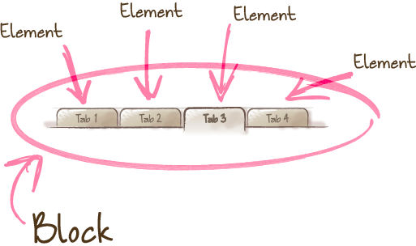
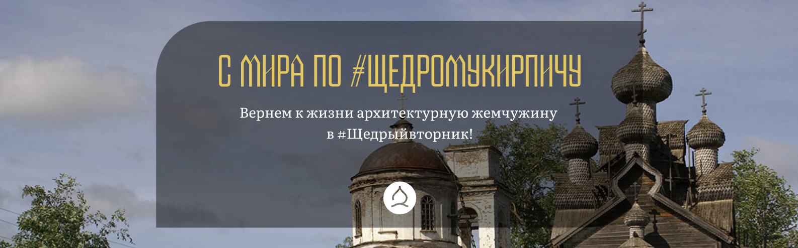
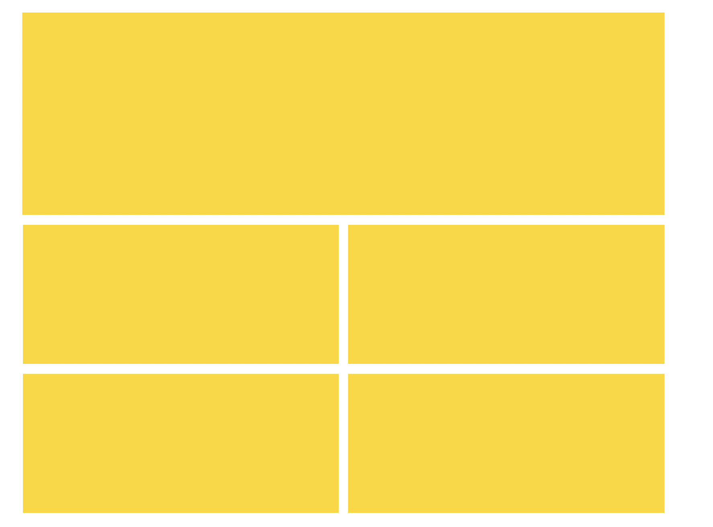
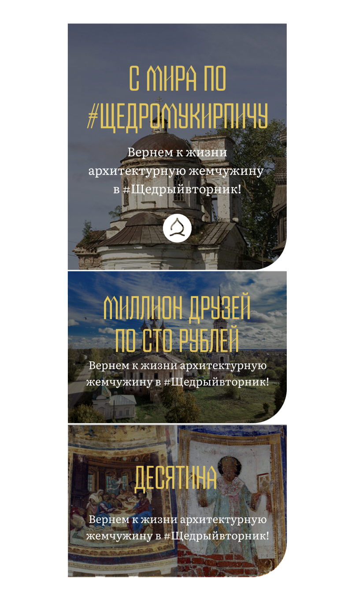

# Про БЭМ

и адаптивную верстку (по возможности)

## Что такое БЭМ, зачем нужен, какие проблемы решает?
БЭМ — компонентный подход к разработке. Базово — это о разбиении интерфейса на блоки. 
Это позволяет:
- Переиспользовать код, не копипастя
- Избегать конфликтов стилей, без странных селекторов
- По коду понимать, что он делает, а значит --
- Легко поддерживать

## Ну, конкретнее можно?
Да, вот такие селекторы, не ясны, сложно поддерживаемы и создают конфликты стилей:

`
.menu-item:not(.menu-item-has-children) > div > a {
	margin-left: $base;
}
`

## Немного матчасти: Уровни специфичности


Уровень специфичности на уровне стилей:

inline < layer < id < class/attribute/pseudo-class < type/pseudo-element

[Классная статья о каскадах](https://2019.wattenberger.com/blog/css-cascade)

Важный пункт: побеждает тот стиль, в котором больше специфичных селекторов самой высокой специфичности. 


Для примера, попробуйте понять, какой стиль выиграет:

```
.paragraph:first-of-type {
  color: sandybrown;
}

p.paragraph {
  color: orchid;
}
```

## Теперь про то, как устроен БЭМ
Методология БЭМ основана на конмпонентном взгляде на верстку. 
Всё разделяется на 3 составляющие
- Блок
- Элемент
- Модификатор

### Блок 


Независимый компонент страницы, который может быть переиспользован.  В HTML определяется атрибутом class.
- Название — это смысл блока, не его состояние.

```
<div class=“error”></div> ✅
<div class=“red-button”></div>❌
```
- Блок определяет только свою внутреннюю геометрию. Как он ориентирован снаружи (отступы, границы, расположение) — не задается
- Блоки можно вкладывать друг в друга

```
<!-- Блок `header` -->
<header class="header">
    <!-- Вложенный блок `logo` -->
    <div class="logo"></div>
</header>
```

### Элемент 


Составная часть блока. Неотделимая от блока, но не обязательная.
- Имя элемента задается по такой схеме: `имя-блока__имя-элемента`

```
<form class="search-form">
    <!-- Элемент `input` блока `search-form` -->
    <input class=“search-form__input”>
</form>
```

### Модификатор


Сущность, которая характеризуется вопросом "Какой?"
- Имя модификатора задается по такой схеме: `имя-блока--модификатор` или `имя-блока__имя-элемента--модификатор` 

```
<form class="search-form">
    <!-- Элемент `input` блока `search-form` -->
    <input class=“search-form__input”>
</form>
```

## Пример
Предположим нам надо сделать такую карточку:



Разобьем ее по методологии БЭМ

```
promo-archive
promo-archive__link
promo-archive__image
promo-archive__cover
promo-archive__title
promo-archive__description
promo-archive__icon
promo-archive__icon--visible
```

Соответсвующий SCSS код:

```
.promo-archive {
  &_link {}
  &_image {}
  &_cover {}
  &_title {}
  &_description {}
  &_icon {
    &--visible {
    }
  }
}
```

## Принципы, на что обращать внимание
- Проектировать страницу на основе модели БЭМ
Надо представлять страницу в виде блоков
- Принцип единой ответсвенности
Каждая БЭМ-сущность решает одну задачу. 
- Когда блок, когда элемент
Блок надо использовать, когда этот компонент не зависит от окружения и может переиспользоваться
- Геометрия
Только внутренняя

## Плюсы и Минусы БЭМ-подхода

### Плюсы:
- Переиспользование кода
- Отсутсвие конфликтов стилей
- Читаемость кода

### Минусы:
- Много текста, прямо очень много
- Внешние библиотеки могут конфликтовать
- Ненулевой порог входа


# А теперь про АДАПТИВНОСТЬ в 2023
Вкратце: грид, флексбокс, контейнер-квери, css-функции

## CSS-функции
- max: `width: max(300px, 50%);`
- min: `height: min(200px, 30vh);`
- minmax: `grid-template-columns: repeat(auto-fit, minmax(200px, 1fr));`
- clamp: `height: clamp(150px, 50vh, 300px);`

## Flex-box


- Организация адаптивной структуры
- Центрирование элементов

```
.flex-block {
	display: flex;
    align-items: center;
    justify-content: center;
}
```

Предположим, мы хотим такую структуру элементов на широких экранах:


И такую на экранах меньше 720px:


Хочется написать что-то вроде такого:

```
.block_promo-archive {}

  .promo-archive:nth-child(n+2) {
    width: calc(50% - 8px);
    float: left;
    height: $promo-height;
    margin-top: 16px;
  }
  .promo-archive:nth-child(2n) {
    clear: both;
    margin-right: 16px;
    @include upto(medium-screens) { 
      margin-right: 2px;
    } 
  }
  .promo-archive {
    @include upto(medium-screens) {
      width: 100% !important;
      clear: both;
      margin-right: 0px;
    } 
  }
```

Попробуем задать то же самое поведение с помощью флекс-бокса:

```
.block_promo-archive {
    flex-wrap: wrap;
    display: flex;
    gap: 20px;
}
.block_promo-archive .promo-archive:nth-child(n+2) {
    flex: max(360px,40%);
```

Заметно короче и элегантнее. Контейнер сам оборачивает элементы и переносит по неободимости на новую строку, а элементы сами определяют свой внутренний размер.


[Все о возможностях Flex](https://css-tricks.com/snippets/css/a-guide-to-flexbox/)

## Grid


- grid-areas
- Больше не использовать position: absolute

```
.pile {
  display: grid;
  place-content: center;
}

.pile > * {
  grid-area: 1/1;
}
```
[Пример](https://pqina.nl/blog/css-grid-position-absolute-alternative/)

[Все о возможностях Grid](https://css-tricks.com/snippets/css/complete-guide-grid/)


## Container-query
Вернемся к примеру с block_promo-archive. Предположим, нам надо сделать, чтобы на широких экранах картинка выглядела так:


И на экранах меньше 720px:



Внешний стиль контейнера мы уже научились определять через flex-box. Попробуем определить геометрию контейнеров без помощи media-query.

```
.promo-archive {
  $root: &;
  container: promo-container / inline-size;
  ...
  &__link {}
  ...
  @container promo-container (min-width: 720px) {
  	#{$root}__link {}
  	...
  }
}
```


## Snap-points
Чтобы делать прокрутку, привязанную к месторасположению, уже не нужно использовать js-библиотеки, это поддерживается в css:

```
.snaps {
  overflow-x: scroll;
  scroll-snap-type: x mandatory;
  overscroll-behavior-x: contain;
}

.snap-target {
  scroll-snap-align: center;
}

.snap-force-stop {
  scroll-snap-stop: always;
}
```

## Ссылки
[БЭМ](https://ru.bem.info/methodology/)

[6 новых возможностей CSS, которые должен знать каждый front-end разработчик в 2023 году](https://habr.com/ru/articles/726224/)

[На английском](https://web.dev/6-css-snippets-every-front-end-developer-should-know-in-2023/)

[Руководство по реализации отзывчивого дизайна в 2023 году](https://habr.com/ru/companies/ruvds/articles/718700/)

[На английском](https://ishadeed.com/article/responsive-design/)

[CanIUse.com --  поддержка css в браузерах](https://caniuse.com/)
